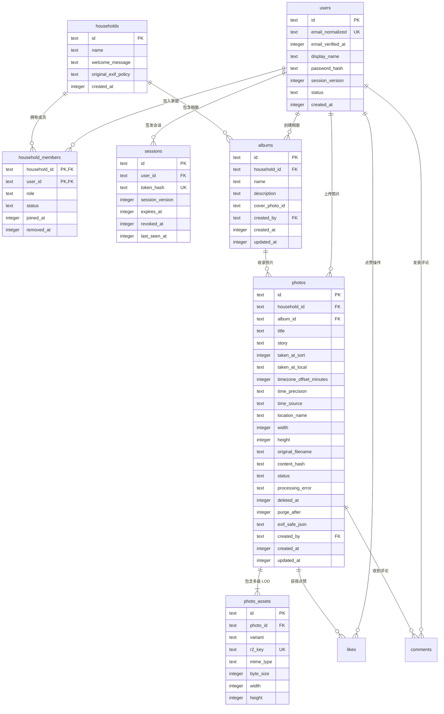

# 数据库设计规范与架构字典 (Cloudflare D1 / SQLite)

- **当前基线**：`a445718`
- **ORM 与迁移框架**：Drizzle ORM (`src/drizzle/schema.ts`)
- **存储引擎**：Cloudflare D1（基于 SQLite 的边缘分布式关系数据库）
- **对象存储**：Cloudflare R2（私有存储桶 `gallery-media-private`）

本文档作为整个系统（前端、Pages Functions API、本地开发中间件、数据导入流水线）的**唯一权威数据库设计基准（Single Source of Truth）**，任何业务开发、查询编写与迁移生成均须严格对照本文档执行，坚决杜绝因字段拼写不一致（如 `display_name` vs `nickname`）导致的运行时故障。

---

## 一、全局命名与设计原则

1. **命名规范**：
   - 物理表名与列名**一律使用全小写下划线** `snake_case`（例如 `display_name`、`email_normalized`、`taken_at_sort`、`r2_key`）。
   - Drizzle ORM 代码层使用对应的小驼峰（例如 `displayName` -> `display_name`）。
2. **时间戳规范**：
   - 系统级时间戳（创建、更新、过期、物理排序时间）统一采用 **毫秒级 Unix 时间戳**（`INTEGER` 类型，如 `Date.now()`）。
   - 墙上显示时间保留文本形式（`taken_at_local`，格式 `YYYY-MM-DD HH:mm:ss`），便于免时区计算展示。
3. **主键与稳定 ID 规范**：
   - `users`: `u_<nanoid>` 或语义化 ID（如 `user_owner_default`）
   - `households`: `h_<nanoid>` 或 `household_default`
   - `photos`: `p_<household>_<contentHash[0..24]>`（96-bit 熵，家庭空间隔离防碰撞）
   - `photo_assets`: `<photoId>_<variant>`
4. **状态流转原则**：
   - 照片主表包含软删除支持：`deleted_at` 记录移入回收站时间戳，`purge_after` 记录 30 天后物理擦除时间戳。
   - 处于 `deleted_at IS NOT NULL` 或 `status != 'ready'` 的照片，对外 API 必须一律不可访问（返回 404）。

---

## 二、核心实体关系图 (ER Diagram)



---

## 三、核心表结构字典 (Schema Data Dictionary)

### 1. `users` (用户主表)

| 列名 (SQL) | Drizzle 映射 | 类型 | 约束 / 默认值 | 说明 |
| :--- | :--- | :--- | :--- | :--- |
| `id` | `id` | `TEXT` | `PRIMARY KEY` | 用户唯一标识 (如 `u_xxx`) |
| `email_normalized` | `emailNormalized` | `TEXT` | `NOT NULL, UNIQUE` | 规范化小写邮箱 (登录凭据) |
| `email_verified_at` | `emailVerifiedAt` | `INTEGER` | `NULL` | 邮箱验证完成时间戳 |
| `display_name` | `displayName` | `TEXT` | `NOT NULL` | 用户展示昵称 (⚠️ **严禁使用 `nickname`**) |
| `password_hash` | `passwordHash` | `TEXT` | `NOT NULL` | 安全密码哈希 (PBKDF2/Argon2) |
| `session_version` | `sessionVersion` | `INTEGER` | `NOT NULL DEFAULT 1` | 会话版本号 (改密/全退时递增失效旧 Token) |
| `status` | `status` | `TEXT` | `NOT NULL DEFAULT 'active'` | 用户状态: `active` \| `suspended` \| `deleted` |
| `created_at` | `createdAt` | `INTEGER` | `NOT NULL` | 创建毫秒时间戳 |

### 2. `sessions` (用户认证会话表)

| 列名 (SQL) | Drizzle 映射 | 类型 | 约束 / 默认值 | 说明 |
| :--- | :--- | :--- | :--- | :--- |
| `id` | `id` | `TEXT` | `PRIMARY KEY` | 会话唯一标识 (`sess_xxx`) |
| `user_id` | `userId` | `TEXT` | `NOT NULL, FK -> users(id)` | 关联用户 ID (级联删除) |
| `token_hash` | `tokenHash` | `TEXT` | `NOT NULL, UNIQUE` | 原始 Token 的 SHA-256 哈希值 |
| `session_version` | `sessionVersion` | `INTEGER` | `NOT NULL` | 签发时的版本号 (必须与 `users.session_version` 一致) |
| `expires_at` | `expiresAt` | `INTEGER` | `NOT NULL` | 会话到期毫秒时间戳 |
| `revoked_at` | `revokedAt` | `INTEGER` | `NULL` | 主动撤回/登出时间戳 |
| `last_seen_at` | `lastSeenAt` | `INTEGER` | `NOT NULL` | 最后活跃毫秒时间戳 |

### 3. `households` (家庭空间主表)

| 列名 (SQL) | Drizzle 映射 | 类型 | 约束 / 默认值 | 说明 |
| :--- | :--- | :--- | :--- | :--- |
| `id` | `id` | `TEXT` | `PRIMARY KEY` | 空间唯一标识 (如 `household_default`) |
| `name` | `name` | `TEXT` | `NOT NULL` | 家庭相册名称 |
| `welcome_message` | `welcomeMessage` | `TEXT` | `NULL` | 空间欢迎寄语 |
| `original_exif_policy`| `originalExifPolicy` | `TEXT` | `DEFAULT 'preserve_all'` | EXIF 策略: `preserve_all` \| `strip_gps` \| `strip_all` |
| `created_at` | `createdAt` | `INTEGER` | `NOT NULL` | 创建时间戳 |

### 4. `household_members` (家庭成员关联表)

| 列名 (SQL) | Drizzle 映射 | 类型 | 约束 / 默认值 | 说明 |
| :--- | :--- | :--- | :--- | :--- |
| `household_id` | `householdId` | `TEXT` | `NOT NULL, FK -> households(id)` | 家庭空间 ID (复合主键 1) |
| `user_id` | `userId` | `TEXT` | `NOT NULL, FK -> users(id)` | 用户 ID (复合主键 2) |
| `role` | `role` | `TEXT` | `NOT NULL` | 空间角色: `owner` \| `member` |
| `status` | `status` | `TEXT` | `NOT NULL DEFAULT 'active'` | 成员状态: `active` \| `removed` |
| `joined_at` | `joinedAt` | `INTEGER` | `NOT NULL` | 加入时间戳 |
| `removed_at` | `removedAt` | `INTEGER` | `NULL` | 移除时间戳 |

- **主键约束**：`PRIMARY KEY (household_id, user_id)`
- **索引**：`idx_members_user_status` ON `(user_id, status)`

### 5. `albums` (相册表)

| 列名 (SQL) | Drizzle 映射 | 类型 | 约束 / 默认值 | 说明 |
| :--- | :--- | :--- | :--- | :--- |
| `id` | `id` | `TEXT` | `PRIMARY KEY` | 相册标识 (`album_default`) |
| `household_id` | `householdId` | `TEXT` | `NOT NULL, FK -> households(id)` | 所属家庭空间 |
| `name` | `name` | `TEXT` | `NOT NULL` | 相册名称 (⚠️ **严禁使用 `title`**) |
| `description` | `description` | `TEXT` | `NULL` | 相册描述 |
| `cover_photo_id` | `coverPhotoId` | `TEXT` | `NULL` | 封面照片 ID |
| `created_by` | `createdBy` | `TEXT` | `NOT NULL, FK -> users(id)` | 创建者用户 ID (⚠️ **必填字段**) |
| `created_at` | `createdAt` | `INTEGER` | `NOT NULL` | 创建时间戳 |
| `updated_at` | `updatedAt` | `INTEGER` | `NOT NULL` | 更新时间戳 |

> ⚠️ **重要提示**：`albums` 表**无** `is_default` 列！首版相册默认为 `album_default`。

### 6. `photos` (照片主表)

| 列名 (SQL) | Drizzle 映射 | 类型 | 约束 / 默认值 | 说明 |
| :--- | :--- | :--- | :--- | :--- |
| `id` | `id` | `TEXT` | `PRIMARY KEY` | 稳定照片 ID (格式 `p_<household>_<hash>`) |
| `household_id` | `householdId` | `TEXT` | `NOT NULL, FK -> households(id)` | 所属家庭空间 |
| `album_id` | `albumId` | `TEXT` | `NOT NULL, FK -> albums(id)` | 所属相册 ID |
| `title` | `title` | `TEXT` | `NULL` | 照片标题 (默认为文件名) |
| `story` | `story` | `TEXT` | `NULL` | 回忆故事 / 器材描述 |
| `taken_at_sort` | `takenAtSort` | `INTEGER` | `NOT NULL` | **规范排序时间戳 (ms)**，游标分页基准 |
| `taken_at_local` | `takenAtLocal` | `TEXT` | `NOT NULL` | 拍摄本地墙上时间 (`YYYY-MM-DD HH:mm:ss`) |
| `timezone_offset_minutes` | `timezoneOffsetMinutes` | `INTEGER` | `NULL` | 本地时区偏移分钟数 |
| `time_precision` | `timePrecision` | `TEXT` | `DEFAULT 'second'` | 时间精度: `second` \| `minute` \| `day` \| `unknown` |
| `time_source` | `timeSource` | `TEXT` | `DEFAULT 'exif'` | 来源: `exif` \| `user` \| `file_mtime` |
| `location_name` | `locationName` | `TEXT` | `NULL` | 拍摄地点名称 |
| `width` | `width` | `INTEGER` | `NULL` | 原始像素宽度 |
| `height` | `height` | `INTEGER` | `NULL` | 原始像素高度 |
| `original_filename` | `originalFilename` | `TEXT` | `NOT NULL` | 原始上传文件名 |
| `content_hash` | `contentHash` | `TEXT` | `NULL` | 原始文件 SHA-256 内容哈希 |
| `status` | `status` | `TEXT` | `NOT NULL DEFAULT 'pending'` | 状态: `pending` \| `processing` \| `ready` \| `failed` \| `trashed` \| `deleting` |
| `processing_error`| `processingError` | `TEXT` | `NULL` | 失败异常信息 |
| `deleted_at` | `deletedAt` | `INTEGER` | `NULL` | 软删除时间戳 (回收站状态) |
| `purge_after` | `purgeAfter` | `INTEGER` | `NULL` | 30 天自动物理清理时间戳 |
| `exif_safe_json` | `exifSafeJson` | `TEXT` | `NULL` | 脱敏后的 EXIF 安全字段 JSON 字符串 |
| `created_by` | `createdBy` | `TEXT` | `NOT NULL, FK -> users(id)` | 上传者用户 ID |
| `created_at` | `createdAt` | `INTEGER` | `NOT NULL` | 记录入库时间戳 |
| `updated_at` | `updatedAt` | `INTEGER` | `NOT NULL` | 最后更新时间戳 |

- **核心索引**：
  - `idx_photos_household_content_hash` ON `(household_id, content_hash)` [UNIQUE 幂等去重]
  - `idx_photos_album_sort` ON `(album_id, status, taken_at_sort, id)` [高频分页]
  - `idx_photos_household_hash` ON `(household_id, content_hash, status)`
  - `idx_photos_purge` ON `(status, purge_after)`

### 7. `photo_assets` (多级 LOD 媒体资产表)

| 列名 (SQL) | Drizzle 映射 | 类型 | 约束 / 默认值 | 说明 |
| :--- | :--- | :--- | :--- | :--- |
| `id` | `id` | `TEXT` | `PRIMARY KEY` | 资产唯一 ID (`ast_xxx` 或 `<photoId>_<variant>`) |
| `photo_id` | `photoId` | `TEXT` | `NOT NULL, FK -> photos(id)` | 所属照片 ID (级联删除) |
| `variant` | `variant` | `TEXT` | `NOT NULL` | 变体: `thumb_low` \| `thumb_high` \| `display` \| `original` \| `depth` |
| `r2_key` | `r2Key` | `TEXT` | `NOT NULL, UNIQUE` | Cloudflare R2 私有存储桶内的唯一对象键 |
| `mime_type` | `mimeType` | `TEXT` | `NOT NULL` | MIME 类型 (如 `image/webp`、`image/jpeg`) |
| `byte_size` | `byteSize` | `INTEGER` | `NOT NULL` | 真实物理文件字节数 |
| `width` | `width` | `INTEGER` | `NULL` | 变体实际像素宽度 |
| `height` | `height` | `INTEGER` | `NULL` | 变体实际像素高度 |

- **唯一约束**：
  - `idx_photo_variant_unique` ON `(photo_id, variant)` [同张照片每个变体唯一]

---

## 四、易错字段与防踩坑对照表 (Pitfall Checklist)

为彻底杜绝后续在代码与 SQL 中出现列名幻觉，全体开发人员与脚本必须牢记以下映射规则：

| 业务含义 | ❌ 严禁使用的错误列名 | ✅ 唯一正确的标准列名 | 所在表 |
| :--- | :--- | :--- | :--- |
| 用户昵称 | `nickname` | **`display_name`** | `users` |
| 登录邮箱 | `email` | **`email_normalized`** | `users` |
| 会话版本号 | (遗漏未查) | **`session_version`** | `sessions` & `users` |
| 相册名称 | `title` | **`name`** | `albums` |
| 默认相册标记 | `is_default` (表中不存在) | (通过固化 ID `album_default` 标识) | `albums` |
| 相册创建人 | (遗漏未填) | **`created_by`** | `albums` |
| 资产变体分类 | `type` | **`variant`** | `photo_assets` |
| 缩略图路径目录 | `thumb_low/` | **`thumbs_low/`** (规范复数) | R2 对象 Key 规范 |

---

## 五、核心业务权威 SQL 模板 (Canonical Queries)

### 1. 生产会话认证与跨租户权限校验 (单次 JOIN 解决 P0-2 & P1-5)

```sql
SELECT 
  s.id AS session_id,
  s.session_version AS session_version,
  s.expires_at AS expires_at,
  s.revoked_at AS revoked_at,
  u.id AS user_id,
  u.display_name AS display_name,
  u.email_normalized AS email,
  u.session_version AS user_session_version,
  u.status AS user_status,
  m.household_id AS household_id,
  m.role AS role,
  m.status AS member_status
FROM sessions s
INNER JOIN users u ON s.user_id = u.id
INNER JOIN household_members m ON u.id = m.user_id
WHERE s.token_hash = ?
  AND s.revoked_at IS NULL
  AND s.expires_at > ?
  AND u.status = 'active'
  AND m.status = 'active'
  -- 若有 targetHouseholdId 则加上：AND m.household_id = ?
LIMIT 1;
```
> **版本校验闭环**：代码中提取后，校验 `session_version === user_session_version`，不匹配则拒绝。

### 2. 稳定复合游标分页查询照片列表 (解决 P1-7)

```sql
SELECT 
  id, album_id, title, story, taken_at_sort, taken_at_local, 
  location_name, width, height, exif_safe_json
FROM photos
WHERE household_id = ?
  AND status = 'ready'
  AND deleted_at IS NULL
  -- 复合游标推进条件 (杜绝同时间戳漏数据):
  AND (taken_at_sort > ? OR (taken_at_sort = ? AND id > ?))
ORDER BY taken_at_sort ASC, id ASC
LIMIT ?; -- 例如 51 (limit + 1 用于计算 hasMore)
```

### 3. 照片详情与媒体流安全读取校验

```sql
-- 1. 校验照片就绪且未在回收站
SELECT id, household_id, status, deleted_at 
FROM photos 
WHERE id = ?;

-- 2. 校验通过且通过当前用户的 household membership 鉴权后，读取变体 Key
SELECT r2_key, mime_type, byte_size 
FROM photo_assets 
WHERE photo_id = ? AND variant = ?;
```
